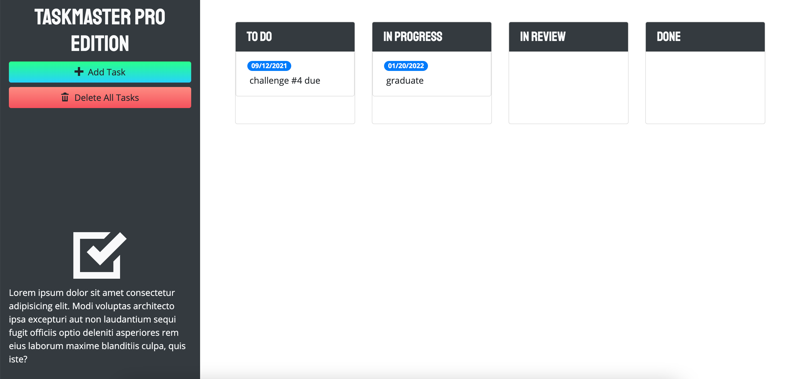

# Taskmaster Pro

## Description 

* Taskmaster Pro is a web application where the user can create task to be accomplished. The user is able to create, move the task status, set a due date, and even delete the task's by dragging and dropping to their ideal column or trash bin. 

## Screenshot

## Website Link
https://kevin-hernandez-garza.github.io/taskmaster-pro/

### Contributed with 💙 by Kevin Hernandez